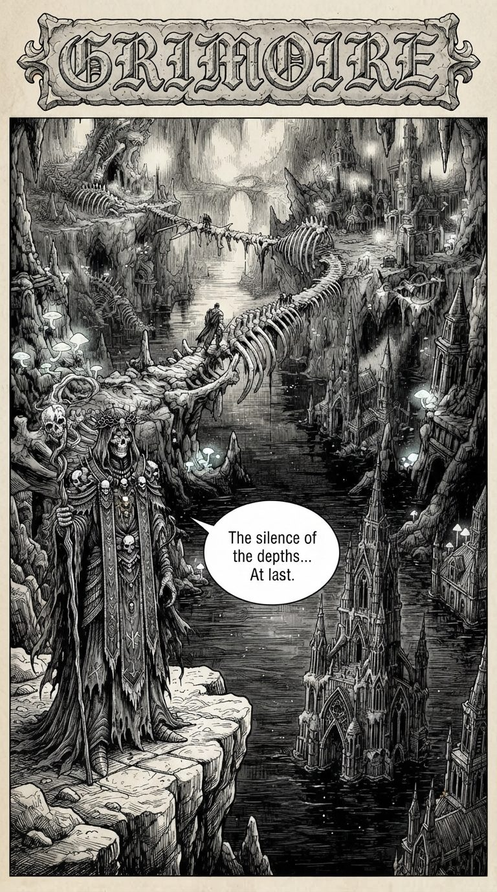

# Manga Creator - from one sentence to a 50-page graphic novel

<p align="center"></p>

<p align="center">
  <b>An AI graphic-novel studio: story bible, character sheets, and page-by-page inking, with characters that stay in character.</b><br>
  <sub>Part of <a href="https://github.com/yeme-oss/Trinifty"><b>Trinifty</b></a> - all nifty stuff - all for free</sub>
</p>

<p align="center">
  <a href="https://www.patreon.com/c/PierreIgorZarebski"></a>
  
</p>

---

## What is it?

Manga Creator is a **studio**, not a prompt box. Describe a story in a few sentences and it helps you write the script, designs your characters, then draws the book page by page. Because every page is generated with your character reference sheets (and the previous pages) as input, a face drawn on page 3 still looks like itself on page 47.

> *"Death is a courtesy the living invented to excuse forgetting. I am merely what remains when the excuse is gone."*
> , Malacor the Sorrowful, from **Grimoire**, a 50-page novella made entirely with this tool.

## Features

- **Multi-project workspace**: each story gets its own folder with `references/` and `pages/`.
- **Story bible**: a structured script split into movements/acts, with tone, key visuals and dialogue. Write it yourself or have the AI draft it, then edit.
- **Character reference sheets**: generated once, then automatically attached whenever a character is named in a page prompt.
- **Style reference image**: show the studio the look you want (ink, watercolour, whimsical, grimdark...).
- **Real pages**: panels, speech bubbles, SFX lettering, title banners.
- **Aspect ratios** 1:1, 3:4, 4:3, 9:16 and 16:9, enforced by a smart centre-crop so every page is exactly the format you asked for.
- **English or French** lettering, with correct accents.
- **Trademark-safe**: the studio rewrites franchise names in your concept into original archetypes before generating.
- **Built-in reader**: single page, two-page spread, or vertical webtoon strip, with zoom and pan.
- Everything is saved to **your disk** as plain `.jpg` and `.json`. No account, no cloud.

## Four books, made with it

They're included in this repo, so you can read them right away (see below).

<table>
  <tr>
    <td width="50%"><br><sub><b>Mimijokie & Mr. Tugs.</b> A pink-ponytailed gnome engineer and a pug who calculates the odds of her inventions exploding (82%).</sub></td>
    <td width="50%"><br><sub><b>Les Sauvageons de Sombrivage.</b> Moonlit forests, a dark elf and a dwarf. Written in French.</sub></td>
  </tr>
  <tr>
    <td colspan="2"><br><sub><b>Echo of Ash.</b> War, ash and golden light: <i>"They broke the high wall! Run!"</i></sub></td>
  </tr>
</table>

**The twist behind *Grimoire*:** most tragedies begin with life and descend into decay. Grimoire runs backwards. It opens on a terrifying skeletal necromancer in a drowned abyss, and with every chapter strips away a layer, until page 50 reveals that the "monster" is the world's most solitary archivist, who gave up peace so that forgotten people would never be erased. The full script is in [`story_bible.md`](story_bible.md).

## Run it

You need Python 3.10+ and a free [Gemini API key](https://aistudio.google.com/apikey).

```bash
pip install -r requirements.txt
cp .env.example .env            # optional: or paste your key in the studio
python server.py                # http://localhost:8000
```

- **Studio:** <http://localhost:8000/MangaCreator.html>. Paste your key (it stays in your browser), create a project, generate references, then pages.
- **Read the books:** <http://localhost:8000/reader.html> opens Grimoire; add `?project=mimijokie`, `?project=les_sauvageons_de_sombrivage` or `?project=echo_of_ash` for the others.

## How it works

```
MangaCreator.html   The studio (single-file front end)
reader.html         The reader
server.py           Small Python server: projects, references, page generation, story bible
projects/<slug>/    project.json, story_bible.md, references/, pages/
pages/ references/  Grimoire, the default book
generate.py         Minimal command-line image generation (text or image-to-image)
```

Images come from Gemini's image model (`gemini-3.1-flash-lite-image`), story text from a Gemini text model, both called with **your** key.

## License

**CC0 1.0: public domain.** Do whatever you like. See [LICENSE](LICENSE) and [NOTICE.md](NOTICE.md).

## Free, really

Keep your hard-earned coins: Manga Creator is free stuff, enjoy. My [Patreon](https://www.patreon.com/c/PierreIgorZarebski) is free to join too, for updates and new releases. More at **[Trinifty](https://github.com/yeme-oss/Trinifty)**.
